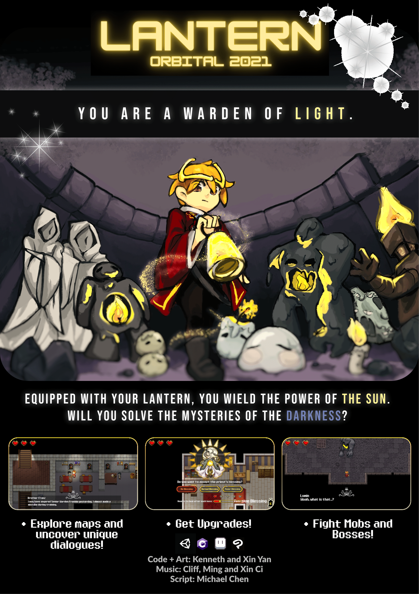
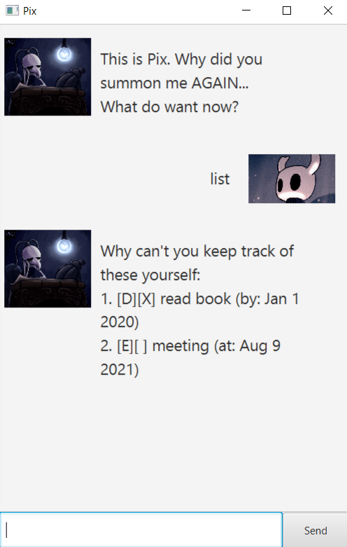

<h1 align="center">Hi 👋, I'm Kenneth Hong!</h1>
<h3 align="center">A Game Developer and Designer from Singapore! 👾</h3>

<h3 align="left">Languages and Tools:</h3>

     

<h2 align="left">My Previous Works:</h2>
<h3 align="left">Games:</h3>
<a href="https://drive.google.com/drive/search?q=lantern">Lantern, a top-down shooter with a gripping and unique storyline</a>  
Made using the Unity Game Engine for the Independent Software Development Project module in NUS.

<h3 align="left">Software Engineering:</h3>

<a href="https://github.com/knotstoks/ip">Pix, the Task Manager</a>  
Made during the Software Engineering Module in NUS.

&nbsp;

